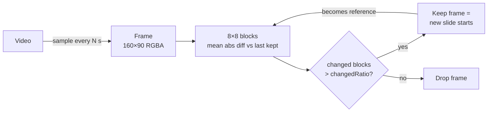

# video-slide-extractor - Extract Slides from Video with JavaScript

Detect **slide changes, scene cuts, and presentation transitions** in video
frames with JavaScript. Use it to build video-to-PowerPoint, lecture-to-slides,
screen-recording-to-PPT, and browser-based slide extraction tools.

The package is pure functions, **zero dependencies**, and runs in the browser or
in Node. Give it frames, get back the indices where a new slide begins.

The library is a **change detector**, not a complete converter: it does not
decode video, capture clean export frames, remove non-consecutive duplicates,
run OCR, or write PowerPoint files. Those stages belong in the surrounding
pipeline.

The bundled **CLI** adds the first two by shelling out to `ffmpeg`, so you can
go straight from a file to slide images without writing any code. `ffmpeg` is a
binary you already have or install once — it never becomes an npm dependency,
and the library stays dependency-free.

This is the open core of **[Video2Any](https://video2any.com)** — a tool that
turns videos, screen recordings, and meeting recordings into editable
PowerPoint decks, PDFs, and subtitles, entirely in your browser (your files
never leave your machine).


*Six of the 39 slides this detector found in "Drones, Virtual Reality and
Multiplayer NES Games with Pion WebRTC" (Sean DuBois, FOSDEM 2021, CC BY 2.0
BE). Not evenly sampled — these are the six a person checked, the same set the
[product page](https://video2any.com/tools/mp4-to-ppt) is willing to be judged
on.*

## See it working

- **Live demo** — drop any video into the
  [MP4 to PPT converter](https://video2any.com/tools/mp4-to-ppt); the
  detection stage is this algorithm.
- **Real output** — a full MIT lecture recording (6.0001, "What is
  Computation?") went in, and
  [46 extracted slides](https://video2any.com/decks/mit-what-is-computation)
  came out — browsable online, with a
  [downloadable sample .pptx](https://video2any.com/decks/mit-what-is-computation/video2any-sample.pptx).
- **Benchmark** — fixed-interval capture vs naive pixel diff vs this detector,
  on fixtures with construction-exact ground truth: [bench/](bench/README.md).

## When to use it

- Extract slides from lecture recordings, webinars, and conference talks.
- Detect presentation changes in screen recordings or meeting recordings.
- Build a video-to-PowerPoint, video-to-PDF, or video-to-Google-Slides pipeline.
- Find scene changes without sending private videos to an AI or cloud API.

## Install

```bash
npm install video-slide-extractor
```

Or skip the install and run the CLI:

```bash
npx video-slide-extractor lecture.mp4
```

## Command line

```bash
npx video-slide-extractor lecture.mp4
```

```
lecture.mp4  1920x1080  01:04:12  sampling 1/s
Calibrating against the footage…
  threshold 0.0180 (bimodal), masking always-moving regions
Detecting slides…
  00:00:00  lecture-slides/slide-001.png
  00:01:34  lecture-slides/slide-002.png
  …
46 slides from 3853 sampled frames → lecture-slides/
```

Requires `ffmpeg` and `ffprobe` on PATH (`brew install ffmpeg`,
`sudo apt install ffmpeg`, or `winget install Gyan.FFmpeg`). The CLI tells you
so, with the install line for your platform, if they are missing.

The CLI makes **no network requests** and sends nothing anywhere. It does print
one line at the end pointing at Video2Any for the stages it does not cover;
`--quiet`, `--json`, and `CI=1` all suppress it.

What it does, in three passes, so memory stays flat whether the recording is
three minutes or three hours:

1. **Calibrate** — samples frames spread across the whole recording and runs
   [`analyzeSamples`](#analyzesamplesframes-width-height-opts--mask-choice) to
   pick a threshold and a webcam/cursor mask for *this* footage.
2. **Detect** — streams every sampled frame through
   [`createSlideDetector`](#createslidedetectorwidth-height-opts--frame--keep-ratio).
   Nothing is retained.
3. **Export** — seeks back to each kept slide and grabs it at **source
   resolution**, from inside the slide's dwell rather than on the boundary, so
   you get the slide itself and not the transition frame before it.

| Option | Default | |
| --- | --- | --- |
| `-o, --out <dir>` | `<video-name>-slides` | output directory |
| `--format <png\|jpg>` | `png` | image format |
| `--fps <n>` | `1` | frames sampled per second |
| `--width <px>` | `320` | detector working width |
| `--changed-ratio <n>` | calibrated | override the detected threshold |
| `--block-size <px>` | `8` | block edge at the working width |
| `--block-delta <n>` | `14` | mean RGB delta for a block to count |
| `--no-calibrate` | off | use fixed defaults instead of reading the footage |
| `--dry-run` | off | detect and report, write no images |
| `--json` | off | machine-readable result on stdout |
| `-q, --quiet` | off | suppress progress |

`--json` prints the source geometry, the settings calibration chose, and every
slide with its index, timestamp, diff ratio, and output path — enough to drive
a longer pipeline from a shell script.

## The idea

A slide deck recorded to video is *mostly still*: the same frame repeats for
seconds, then the whole surface changes at once when the presenter advances.
So we don't need "AI" to find the slides — we need a change detector that
ignores compression noise.

1. Downsample each frame to a small fixed size (e.g. 160×90) as RGBA.
2. Split it into 8×8 blocks. For each block, compute the **mean absolute
   difference** against the previous kept frame.
3. A block "changed" if that mean exceeds `blockDelta`. Averaging over a block
   absorbs the per-pixel noise a lossy codec introduces.
4. If the **fraction of changed blocks** exceeds `changedRatio`, this frame
   starts a new slide.



## Usage

### Browser — from a `<video>` element

```js
import { createSlideDetector } from 'video-slide-extractor';

const W = 160, H = 90;               // diff resolution — small is fine
const canvas = new OffscreenCanvas(W, H);
const ctx = canvas.getContext('2d', { willReadFrequently: true });
const detect = createSlideDetector(W, H);

const slides = [];
for (let t = 0; t < video.duration; t += 2) {   // sample every 2s
  video.currentTime = t;
  await new Promise(r => (video.onseeked = r));
  ctx.drawImage(video, 0, 0, W, H);
  const { data } = ctx.getImageData(0, 0, W, H); // RGBA
  if (detect(data).keep) slides.push(t);         // new slide at time t
}
// `slides` now holds the timestamps of each distinct slide.
```

### Node — from frames you already have

```js
import { extractSlideIndices } from 'video-slide-extractor';

// frames: an ordered array of RGBA buffers (Uint8ClampedArray / Buffer),
// each width*height*4 bytes. Extract them however you like — e.g. with ffmpeg:
//   ffmpeg -i talk.mp4 -vf "fps=1/2,scale=160:90" -pix_fmt rgba -f rawvideo out.raw
const keep = extractSlideIndices(frames, 160, 90);
console.log('new slide at sample #', keep); // e.g. [0, 4, 9, 15]
```

## Guides

- [How to extract slides from a video in JavaScript](docs/extract-slides-from-video.md)
- [How video to PowerPoint conversion works](docs/video-to-powerpoint.md)
- [Detect slide changes in screen recordings](docs/screen-recording-to-slides.md)
- [Frame differencing vs AI for slide extraction](docs/frame-differencing-vs-ai.md)
- [How to evaluate a slide-change detector](docs/evaluation.md)

## How it compares — measured

`bench/` renders videos from known slide sequences (ground truth exact by
construction, no manual labeling) and scores three approaches under one frozen
sampling setup. Headline numbers from the 46-slide MIT deck fixture:

| Method | clean F1 | noisy F1 | overlay F1 |
| --- | --- | --- | --- |
| Fixed interval (10 s) | 0.68 | 0.68 | 0.68 |
| Naive pixel diff (2%) | 0.94 | 0.94 | 0.91 |
| **Block diff (this package, defaults)** | **0.97** | **0.97** | 0.54 |
| Block diff (`changedRatio: 0.10`) | 0.89 | 0.89 | **0.93** |

Two honest takeaways: block averaging wins on clean and compressed input, and
the default `changedRatio` floods on a persistent webcam overlay — thresholds
are inputs to report, not constants (the full product auto-calibrates and
masks; see below). Full tables, scripts, and methodology:
[bench/README.md](bench/README.md) · [bench/RESULTS.md](bench/RESULTS.md).

## Capability boundary

| Stage | Library | CLI | A complete converter still needs |
| --- | --- | --- | --- |
| Decode/sample video | No | Yes, via `ffmpeg` | `<video>`/WebCodecs, FFmpeg, or another decoder |
| Detect consecutive visual changes | Yes | Yes | Feed ordered, equally sized RGBA frames |
| Ignore a webcam bubble / cursor / logo | Yes | Yes | Calibrate on a set of sample frames first |
| Pick a threshold for this footage | Yes | Yes | Calibrate on a set of sample frames first |
| Collapse fades/builds | No | No | Temporal post-processing |
| Find a slide shown earlier | No | No | Global perceptual deduplication |
| Capture export-quality images | No | Yes, via `ffmpeg` | Seek/recapture at source resolution |
| Produce PPTX/PDF/OCR/notes | No | No | Document, OCR, and transcription layers |

This boundary matters when comparing "video to PowerPoint" tools: slide-change
detection, original-slide recovery, and generating a new deck from a transcript
are related but different tasks.

## Related resources

- [Awesome Video to Slides](https://github.com/larry-xue/awesome-video-to-slides) - Curated tools and libraries for converting videos, lectures, webinars, and screen recordings into slides, PowerPoint, PDFs, and notes.

## API

### `frameDiff(a, b, width, height, opts?) → { ratio, isNewSlide }`
Compare two RGBA frames of the same size. `ratio` is the fraction of blocks
that changed; `isNewSlide` is `ratio > changedRatio`.

### `createSlideDetector(width, height, opts?) → (frame) => { keep, ratio }`
Stateful. Feed frames in order; `keep === true` means the frame starts a new
slide and becomes the new reference. The first frame is always kept.

### `extractSlideIndices(frames, width, height, opts?) → number[]`
Run the detector over an ordered array of frames; return the indices that
start a new slide.

### `buildActivityMask(frames, width, height, opts?) → Uint8Array | null`
One byte per block, `1` meaning "leave this block out". Blocks that change in
more than `activeFrac` (default `0.5`) of consecutive frame pairs are a webcam
overlay, cursor, logo animation, or embedded video — not slide content.

Returns `null` when there is nothing to mask, when there are fewer than 8
frames, or when the mask would cover more than `maxMaskFrac` (default `0.35`)
of the frame. That last case is the point: **if most of the picture is moving,
the moving part is the subject**, and masking it would hide the changes you are
looking for.

### `calibrateThreshold(ratios, opts?) → number | null`
1-D Otsu split between the "same slide" noise cluster and the "slide changed"
cluster. Returns `null` when the distribution is not bimodal enough to trust —
act on the fallback, not on a split that is really just noise.

### `chooseThreshold(ratios, opts?) → { changedRatio, mode }`
`calibrateThreshold` with the fallbacks handled, over three regimes. `mode`
tells you which one it decided on:

| mode | footage | threshold |
| --- | --- | --- |
| `bimodal` | a slide deck with a clean gap between clusters | the Otsu split |
| `static` | one slide and noise the whole way through | the default |
| `motion` | talking head / camera footage, everything moves | median + 2·MAD |
| `default` | fewer than 6 ratios — cannot classify | the default |

The `motion` case is why one fixed number does not work: on footage where every
sampled pair changes, `0.02` makes every frame a slide.

### `analyzeSamples(frames, width, height, opts?) → { mask, choice }`
Runs both of the above over a set of sample frames and returns what to detect
with. **This is the function most callers want.**

The mask is only kept when masking turns the video back into deck-like content
(`bimodal` or `static`) — that is the webcam-overlay-on-slides case. On genuine
motion footage the always-moving region *is* the subject, so the mask is
discarded even though one could be built.

```js
import { analyzeSamples, createSlideDetector } from 'video-slide-extractor';

const { mask, choice } = analyzeSamples(sampleFrames, W, H);
const detect = createSlideDetector(W, H, { mask, changedRatio: choice.changedRatio });
```

Or in one call, when the frames you want indices for are also the frames to
calibrate on:

```js
extractSlideIndices(frames, W, H, { calibrate: true });
```

### Options

| option         | default | meaning                                                |
|----------------|---------|--------------------------------------------------------|
| `blockSize`    | `8`     | px per block edge, at the diff resolution              |
| `blockDelta`   | `14`    | mean \|ΔRGB\| per channel for a block to count changed |
| `changedRatio` | `0.02`  | fraction of changed blocks that flags a new slide      |
| `mask`         | none    | blocks to leave out of scoring — see `buildActivityMask` |
| `collect`      | `false` | `frameDiff` only: also return per-block `flags`        |

The defaults are starting points, not universal accuracy claims. Sampling
interval, codec noise, transitions, animations, camera overlays, and crop area
all affect results. Report the complete configuration when publishing a
benchmark; the [evaluation guide](docs/evaluation.md) provides a shared format.

## What's not in here

This is a change detector. The full **Video2Any** pipeline adds the stages
around it:

- **Transition collapse & global dedup** — a fade caught mid-transition settles
  onto the clean frame, and a presenter jumping back to an earlier slide is
  recognized as a duplicate. Global dedup in particular has to see the whole
  video at once, which is a pipeline job, not a detector one.
- **Slide density control** — raising the threshold when a span is producing
  more slides than the caller asked for, without ever lowering it to reach a
  target (that would invent slides that are not there).
- **Decode and sampling in the browser** — the CLI covers this with `ffmpeg`,
  which means a local binary and a temp-file round trip. The product does it
  with WebCodecs and a smarter seek strategy, so nothing leaves the page.
- **Export** to `.pptx`, PDF, image frames, and `.srt` subtitles — all in the
  browser.

If you want the finished product, it's free at **<https://video2any.com>**.

## License

MIT © Video2Any
